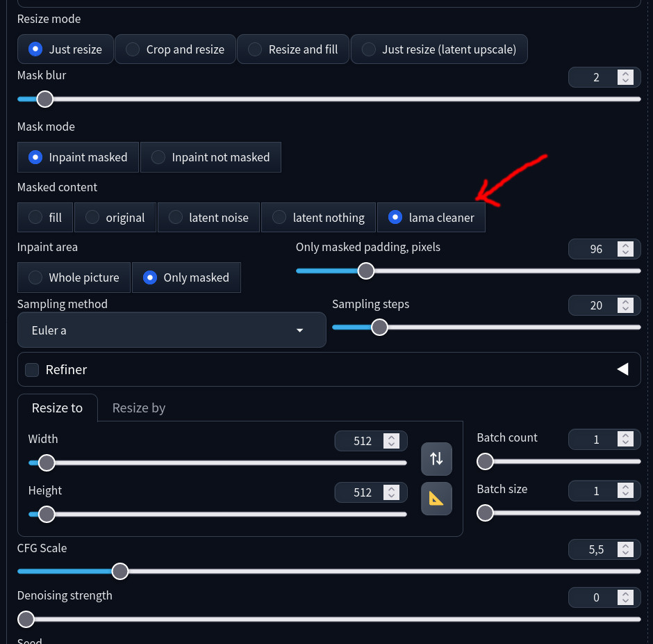
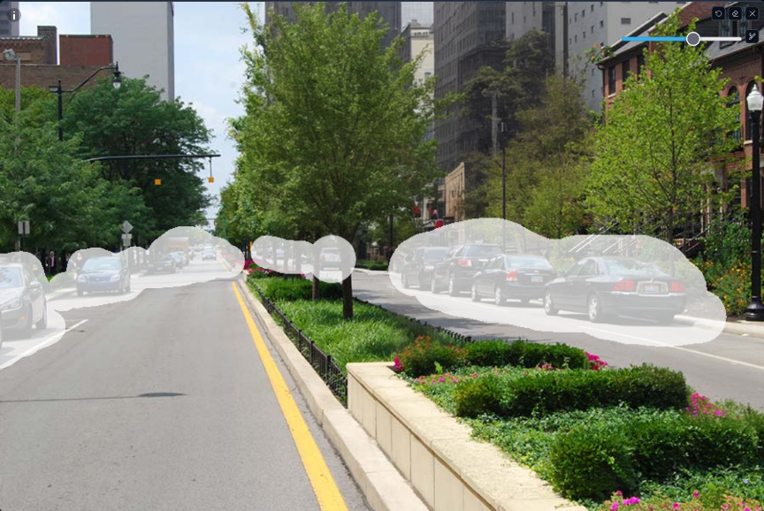
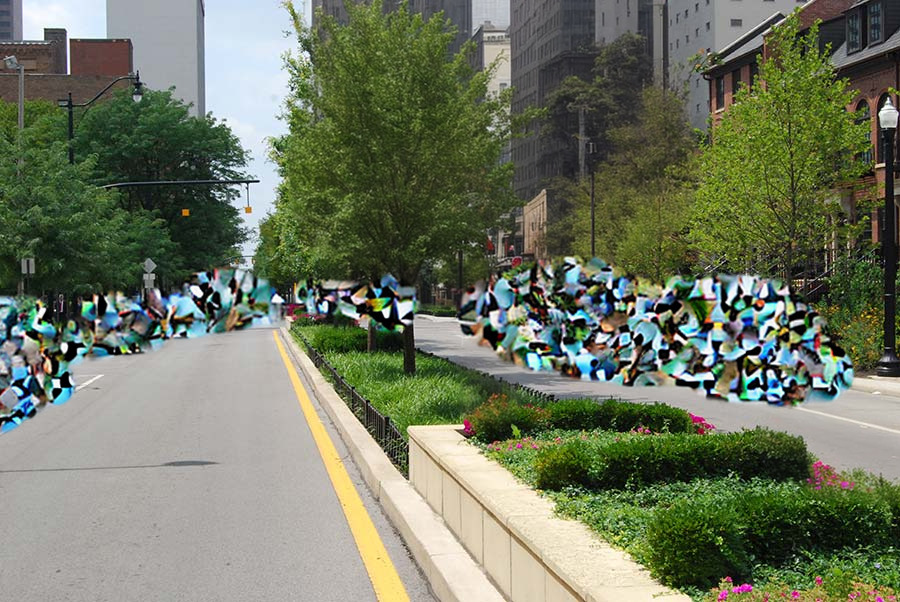

# Lama cleaner as masked content

This extenstion for [AUTOMATIC1111/stable-diffusion-webui](https://github.com/AUTOMATIC1111/stable-diffusion-webui) adds new value of "Masked content" field in img2img -> inpaint tab. It uses preprocessor from controlnet extension, and allows use it with regular inpainting. So this extension requires [Mikubill/sd-webui-controlnet](https://github.com/Mikubill/sd-webui-controlnet)

This option means how to preprocess masked content before pass it into stable diffusion. It useful when you want to remove object in photo. Use inpainting model and denoising straight +-0.4

Mask:

lama cleaner:

fill:

original:

latent noise:

latent nothing:

## Options

Lama cleaner works in 256p resolution, so you can choose upscaler for it.

Go to Settings -> Postprocessing -> Upscaling -> Upscaler for lama cleaner masked content:

Default is `ESRGAN_4x`
